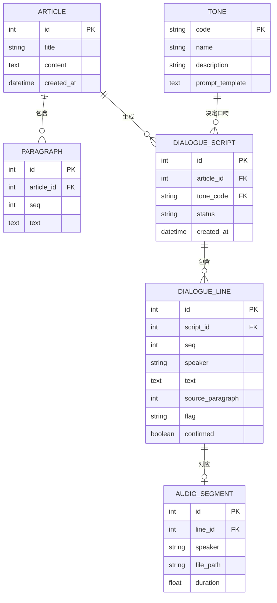
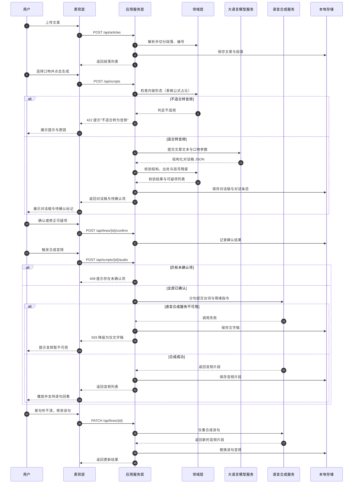

# 「对白」数据与接口设计

> 来源：实验3《软件架构与界面设计》。章节编号沿用原报告。

### 2.4 数据、接口与核心流程设计

#### 2.4.1 核心数据模型

**图4 核心数据模型图（ER 图）**：一篇文章包含多个段落（`PARAGRAPH`），段落编号 `seq` 是出处回溯的基础；一篇文章可生成多份对话稿（对应"换一种口吻重听"），每份对话稿由多条对话条目组成；每条对话条目通过 `source_paragraph` 指向原文段落，通过 `flag` 标记可疑类型（术语、数字、无出处），`confirmed` 记录用户是否已确认；`AUDIO_SEGMENT` 与对话条目一对一，支持"仅重做该句"。

**表11 核心数据对象与字段说明**

| 数据对象 | 关键字段 | 约束 | 是否需保存 | 是否敏感 |
| --- | --- | --- | --- | --- |
| Article | id、title、content、created_at | title 非空 | 是 | 否（用户自有资料） |
| Paragraph | article_id、seq、text | seq 在文章内唯一且连续 | 是 | 否 |
| DialogueScript | article_id、tone_code、status、created_at | tone_code 必须来自 Tone 表 | 是 | 否 |
| DialogueLine | script_id、seq、speaker、text、source_paragraph、flag、confirmed | speaker 取值限定为两个角色；source_paragraph 必须指向本文已有段落；flag 为空表示无疑点 | 是 | 否 |
| Tone | code、name、description、prompt_template | code 为主键，共 6 条预置 | 是 | 否 |
| AudioSegment | line_id、speaker、file_path、duration | 与 DialogueLine 一对一 | 是（文件形式） | 否 |

**敏感数据说明**：本项目不采集账号、手机号、位置等个人信息；唯一的用户数据是**用户自行上传的文章内容**，默认存放于本机 SQLite 与本地目录，不上传至除模型服务与语音合成服务之外的其他系统，且不用于模型训练（对应 NFR5）。

#### 2.4.2 接口设计

**表12 主要接口清单**

| 接口 | 提供模块 | 调用方 | 用途 | 输入 | 输出 | 失败情况 |
| --- | --- | --- | --- | --- | --- | --- |
| POST /api/articles | 应用服务层 | 前端 | 上传并解析文章 | 文件或 Markdown 文本 | article_id、段落列表 | 文件过大、编码不支持、内容为空 |
| POST /api/scripts | 应用服务层 | 前端 | 生成对话稿 | article_id、tone_code | script_id、状态 | 模型超时、结构化输出不合规、内容不适合转音频 |
| GET /api/scripts/{id} | 应用服务层 | 前端 | 获取对话稿 | script_id | 对话条目列表 | 记录不存在 |
| PATCH /api/lines/{id} | 应用服务层 | 前端 | 修正单句台词 | 新的 text | 更新后的条目 | 条目不存在、超出长度限制 |
| POST /api/lines/{id}/confirm | 应用服务层 | 前端 | 确认可疑处 | 确认结果 | 确认后的条目 | 该条目未被标记为待确认 |
| POST /api/scripts/{id}/audio | 应用服务层 | 前端 | 合成音频 | script_id | 音频片段列表 | 存在未确认项、语音合成服务不可用 |
| GET /api/audio/{segment_id} | 基础设施层 | 播放器 | 读取音频片段 | segment_id | 音频流 | 文件缺失 |
| GET /api/paragraphs/{id} | 应用服务层 | 前端 | 出处回溯 | paragraph_id | 段落原文 | 记录不存在 |

**表13 接口调用示例**

| 类型 | 场景 | 请求 | 响应 |
| --- | --- | --- | --- |
| 正常调用 | 生成对话稿 | `POST /api/scripts`，请求体：`{"article_id": 12, "tone_code": "teacher_student"}` | `200`，响应体：`{"script_id": 34, "status": "generated", "lines": 42, "pending_confirm": 2}` |
| 错误调用 | 文章以表格为主，不适合转音频 | `POST /api/scripts`，请求体：`{"article_id": 15, "tone_code": "teacher_student"}` | `422`，响应体：`{"error": "NOT_SUITABLE_FOR_AUDIO", "reason": "表格与公式占比 83%，无法朗读", "suggestion": "请改用文字摘要形式"}` |
| 错误调用 | 语音合成服务不可用 | `POST /api/scripts/34/audio` | `503`，响应体：`{"error": "TTS_UNAVAILABLE", "fallback": "text_only", "message": "音频暂不可用，文字稿已保存，可稍后重试"}` |
| 错误调用 | 存在未确认的可疑项 | `POST /api/scripts/34/audio` | `409`，响应体：`{"error": "PENDING_CONFIRMATION", "pending_line_ids": [201, 207]}` |

#### 2.4.3 核心任务流程设计

**图5 核心任务顺序图**：完整呈现"上传→生成→确认→合成→播放→单句修正"的过程。图中包含三处关键控制：①**内容形态判断**失败时直接返回提示，不进入生成；②**人工确认点**，存在未确认的可疑项时拒绝合成音频（返回 409）；③**语音合成失败的降级路径**，此时保存文字稿并明确提示，已生成内容不丢失。

---

