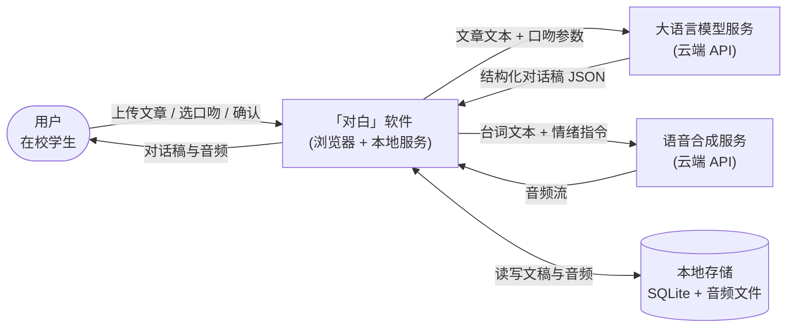
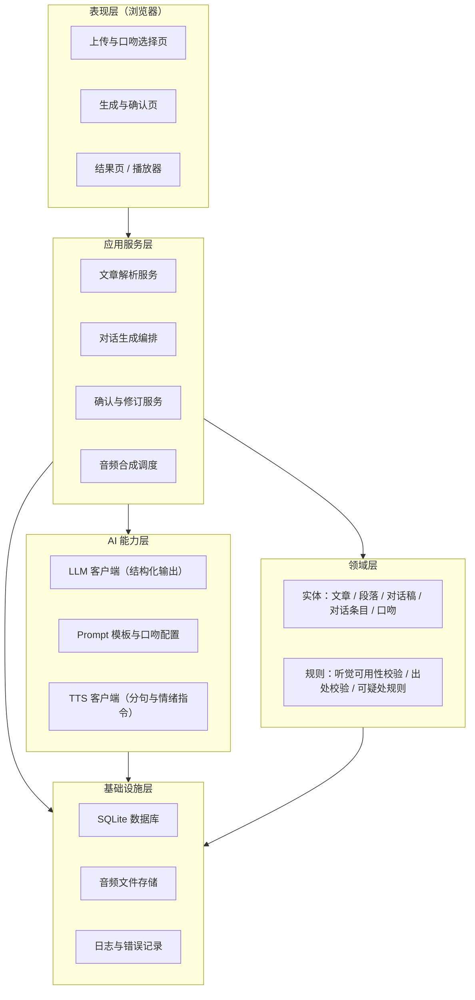
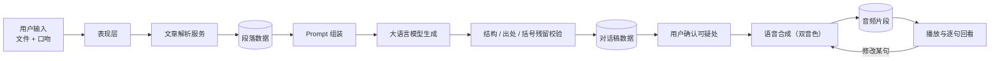

# 「对白」架构设计

> 来源：实验3《软件架构与界面设计》。章节编号沿用原报告。

### 2.3 软件架构与模块设计

#### 2.3.1 软件与外部环境关系图

**图1 软件与外部环境关系图**：用户为在校学生；「对白」软件本身包含浏览器界面与本地服务两部分；大语言模型服务与语音合成服务均为**外部依赖**，以云端 API 方式调用（实施时若切换为本地模型，则改由本机推理服务承担，图中位置相应移入本地）。本地存储保存文章、对话稿与音频文件，属于本软件自身的数据边界，不对外共享。

#### 2.3.2 软件总体架构图

**图2 软件总体架构图**：采用分层架构。**表现层**负责页面与交互；**应用服务层**负责流程编排（解析、生成、确认、合成）；**领域层**保存核心实体与校验规则；**AI 能力层**封装所有对外部模型的调用，是唯一与模型服务直接交互的层；**基础设施层**提供存储与日志。依赖方向自上而下，AI 能力层与基础设施层不反向依赖表现层，从而保证模型服务可被替换（对应表8 的替代方案）。

#### 2.3.3 模块职责与依赖关系

**图3 模块依赖与数据流向图**：展示核心流程中数据在各模块之间的流动顺序。数据从用户输入开始，经解析落库为段落数据；再由 Prompt 组装提交模型生成，生成结果必须通过结构、出处与括号残留三项校验后才能落库为对话稿；对话稿须经用户确认才进入语音合成，合成结果落为音频片段供播放。图中最后一条回边对应"单句修正后仅重做该句"。

**表9 模块职责与依赖关系**

| 模块 | 主要职责 | 依赖 | 被谁依赖 |
| --- | --- | --- | --- |
| 上传与口吻选择页 | 收集文件与口吻参数，展示历史记录 | 应用服务层 API | —（入口） |
| 生成与确认页 | 展示生成进度，列出可疑处供用户确认或修正 | 应用服务层 API | — |
| 结果页 / 播放器 | 播放音频、逐句高亮、展示原文出处 | 应用服务层 API、音频文件 | — |
| 文章解析服务 | 解析上传文件，切分段落并编号 | 基础设施层 | 应用服务层内部 |
| 对话生成编排 | 组装 Prompt、调用 LLM、校验输出、持久化 | AI 能力层、领域层、基础设施层 | 表现层 |
| 确认与修订服务 | 记录确认结果、处理单句修正与局部重合成 | 领域层、AI 能力层 | 表现层 |
| 音频合成调度 | 分句调用 TTS、拼接、响度归一化 | AI 能力层、基础设施层 | 表现层 |
| 领域实体与规则 | 定义数据结构与校验规则（听觉可用性、出处、可疑处） | — | 应用服务层 |
| LLM 客户端 | 封装模型调用与结构化输出校验 | Prompt 模板 | 对话生成编排 |
| TTS 客户端 | 封装语音合成、音色分配、情绪指令 | — | 音频合成调度、确认与修订服务 |
| 存储与日志 | 读写数据库与音频文件、记录运行日志 | — | 各层 |

**表10 用户—普通程序—模型—工具职责划分表**

| 核心流程环节 | 用户 | 普通程序 | 模型 | 外部工具或服务 | 由谁检查 AI 结果 |
| --- | --- | --- | --- | --- | --- |
| 上传与解析 | 上传文件 | 解析、切分段落、编号 | — | — | — |
| 内容形态判断 | — | 统计表格公式占比并套用阈值 | 判断是否适合转音频 | — | 程序（阈值）+ 用户（采纳提示） |
| 生成对话稿 | 选择口吻 | 组装 Prompt、校验 JSON 结构 | 生成双人对话 | 大语言模型服务 | **程序（结构、出处、括号残留）+ 用户（可疑处）** |
| 听觉可用性校验 | — | 检测并清除括号、编号、图表引用 | — | — | 程序 |
| 可疑处确认 | 确认或修正 | 记录确认结果，拦截未确认项 | 标注可疑处 | — | 用户 |
| 音频合成 | 触发合成 | 分句、分配音色、调度与拼接 | 合成语音 | 语音合成服务 | 程序（时长与静音检测） |
| 播放与回看 | 收听、点击某句 | 播放控制、逐句高亮、出处定位 | — | 浏览器播放器 | 用户 |
| 单句修正 | 修改某句 | 定位并仅重合成该句 | 合成该句语音 | 语音合成服务 | 用户 |

---

