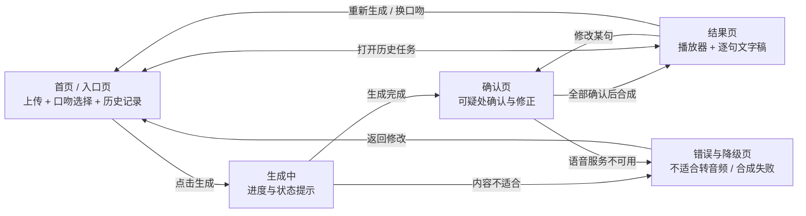

# 「对白」界面原型

> 来源：实验3《软件架构与界面设计》。章节编号沿用原报告。

### 2.5 界面原型与交互设计

#### 2.5.1 页面结构与导航关系



**图6 页面结构与导航关系图**：软件入口为首页，核心路径为"首页→生成中→确认页→结果页"。异常路径有两条：内容不适合转音频、语音合成不可用，均进入错误与降级页并提供返回修改的出口。结果页可返回确认页修改单句，也可返回首页换口吻重新生成。

#### 2.5.2 界面原型一：首页 / 入口页

**图7 首页 / 入口页原型**

```text
┌────────────────────────────────────────────────────────────┐
│  「对白」把文章，聊给你听                                    │
├────────────────────────────────────────────────────────────┤
│                                                            │
│  ┌──────────────────────────────────────────────────────┐  │
│  │                                                      │  │
│  │        拖拽文件到此处，或 点击选择文件               │  │
│  │        支持 Markdown / txt，单篇不超过 3000 字        │  │
│  │                                                      │  │
│  └──────────────────────────────────────────────────────┘  │
│                                                            │
│  选择口吻：                                                │
│  ( ) 师生   (•) 抬杠   ( ) 老少                            │
│  ( ) 访谈   ( ) 播客对谈   ( ) 睡前                        │
│                                                            │
│           [ 开始生成 ]            ← 未选文件时禁用（灰）    │
│                                                            │
├────────────────────────────────────────────────────────────┤
│  历史记录                                                   │
│  ┌──────────────────────────────────────────────────────┐  │
│  │ 光合作用.docx      抬杠    42 句   09-28 10:20  [播放]│  │
│  │ 数据报告.pdf       师生    —       09-28 09:55  [重试]│  │
│  └──────────────────────────────────────────────────────┘  │
│  （无记录时显示：还没有生成过内容，上传一篇文章试试）      │
└────────────────────────────────────────────────────────────┘
```

**图7 说明**：本页包含三类元素——**静态元素**（标题、说明文字、分区标题）、**用户输入元素**（文件拖拽区、口吻单选组）、**用户命令元素**（开始生成按钮）。交互约束：未选择文件时"开始生成"按钮置灰（禁用）；选择文件后按钮变为可用；点击后进入生成中状态。历史记录区展示每条任务的**口吻、句数、时间**，并提供"播放"或"重试"入口。**空数据状态**下显示引导文案，而非空白区域。

#### 2.5.3 界面原型二：核心任务页（生成与确认）

**图8 核心任务页原型**

```text
┌────────────────────────────────────────────────────────────┐
│  ← 返回        光合作用.docx · 抬杠口吻                      │
├────────────────────────────────────────────────────────────┤
│  [ 生成中 ]  已解析 6 段 · 正在生成对话稿…                  │
│  ████████████░░░░░░░░  56%        预计还需 20 秒            │
├────────────────────────────────────────────────────────────┤
│  待确认（2 项）    ← 人工确认点，必须处理后才可合成音频     │
│                                                            │
│  ⚠ 第 12 句 · 术语读法不确定                                │
│     "类囊体薄膜" 是否应读作"类囊体膜"？                     │
│     [ 保留原文读法 ]  [ 改为：________ ]                    │
│                                                            │
│  ⚠ 第 27 句 · 原文未支持                                    │
│     该句无可对应的原文段落，是否删除？                      │
│     [ 删除该句 ]  [ 保留并标记 ]                            │
│                                                            │
├────────────────────────────────────────────────────────────┤
│  对话稿预览（节选）                                         │
│  甲：叫"暗反应"？那我半夜把绿萝搬去没灯的地方…              │
│  乙：不是。原文 P1 说的是"不需要光直接参与"…                │
│                                                            │
│  [ 全部确认并合成音频 ]       [ 仅保存文字稿 ]              │
└────────────────────────────────────────────────────────────┘
```

**图8 说明**：本页承载两种状态。**加载状态**以进度条与剩余时间提示呈现；**人工确认状态**以待确认清单形式呈现，每条可疑项标注**类型**（术语读法 / 原文未支持）、**句序**、**具体问题**，并给出可执行操作（保留 / 修改 / 删除 / 标记）。交互约束：存在未确认项时，"全部确认并合成音频"按钮不可用，点击会收到 409 提示；用户也可以选择"仅保存文字稿"，直接走降级路径。

#### 2.5.4 界面原型三：结果页（播放与回看）

**图9 结果页原型**

```text
┌────────────────────────────────────────────────────────────┐
│  ← 返回        光合作用.docx · 抬杠口吻 · 42 句              │
├────────────────────────────────────────────────────────────┤
│  播放器                                                     │
│  ▶ ━━━━━━━━━●━━━━━━━━━━━━━━━  03:12 / 12:40                │
│  [ 上一句 ]  [ 暂停 ]  [ 下一句 ]   倍速 1.0x   音量 ▮▮▮   │
│  已支持：锁屏播放 · 断点续播                                │
├────────────────────────────────────────────────────────────┤
│  文字稿（当前句高亮）                                       │
│                                                            │
│  甲  叫"暗反应"？那我半夜把绿萝搬去没灯的地方…              │
│  乙  不是。原文 P1 说的是"不需要光直接参与"…   ← 正在播放   │
│      └ 出处：P1 点击查看原文    [ 修改这句 ] [ 重做这句 ]   │
│  甲  那中午太阳最猛，光合作用该最快吧？                     │
│  乙  原文 P6 说反而下降，这叫"光合午休"…                    │
│                                                            │
├────────────────────────────────────────────────────────────┤
│  [ 换一种口吻重新生成 ]   [ 导出文字稿 ]                    │
└────────────────────────────────────────────────────────────┘
```

**图9 说明**：本页是核心结果页，包含**动态元素**（播放进度、当前句高亮、时间显示）、**用户命令元素**（播放暂停、上一句下一句、修改这句、重做这句、换口吻重新生成、导出文字稿）。关键交互：点击"出处：P1"展开该段原文，实现出处回溯（US3）；点击"修改这句"进入单句修正，保存后**仅重做该句音频**，其余内容不变（UC5）；"换一种口吻重新生成"返回首页并保留当前文章（US2）。**错误状态**：音频片段缺失时，该句显示"音频不可用"，仍可阅读文字。

---

