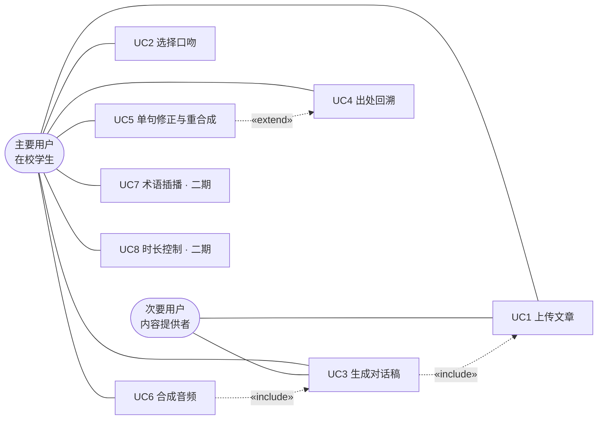

# 「对白」需求说明 V1

> 来源：实验2《个人软件选题与需求分析》。章节编号沿用原报告。

### 2.4 用户故事、需求与验收条件

#### 2.4.1 用户故事（表7）

**表7 用户故事**

| 编号 | 用户故事 | 优先级 |
| --- | --- | --- |
| US1 | 作为一名想在通勤路上利用时间的学生，**我希望**把一篇文章变成两个人聊天的音频，**以便**我不用盯着屏幕也能听懂内容 | P0 |
| US2 | 作为一名会反复听同一篇文章的人，**我希望**换一种口吻重新生成，**以便**听第二遍时不觉得乏味 | P1 |
| US3 | 作为一名需要记住专业术语的人，**我希望**听到某句时能点开核对原文对应段落，**以便**确认读法是否正确 | P1 |
| US4 | 作为一名读到关键概念想深究的人，**我希望**按下按键就能听到一句解释并自动继续播放，**以便**不打断收听节奏（二期） | P2 |
| US5 | 作为一名通勤时间固定的人，**我希望**指定"给我 15 分钟的版本"，**以便**音频长度与我的行程匹配（二期） | P2 |

#### 2.4.2 验收条件（表8）

**表8 验收条件（给定—当—那么）**

| 编号 | 类型 | 验收条件 |
| --- | --- | --- |
| AC1 | 正常 | **给定**一篇约 3000 字的 Markdown 文章，**当**用户选择"师生"口吻并点击生成，**那么**系统应在 60 秒内产出双人对话稿与音频，且对话文本中不出现括号补充、编号列表、"见图N"等仅可阅读的元素 |
| AC2 | 正常 | **给定**已生成的对话稿，**当**用户点击任意一句，**那么**系统应显示该句对应的原文段落号与原句内容 |
| AC3 | 失败或信息不足 | **给定**一篇以表格与公式为主的文章，**当**用户上传时，**那么**系统应提示"本篇不适合转为音频"并说明原因，而不是直接开始生成 |
| AC4 | 需人工确认 | **给定**生成结果中存在 AI 标记为不确定的术语，**当**生成完成时，**那么**系统应将其列为"待确认"，在用户确认前不对该句合成音频 |
| AC5 | 异常 | **给定**语音合成服务不可用，**当**用户请求生成音频，**那么**系统应输出并保存完整文字稿，并明确提示音频暂不可用 |

#### 2.4.3 用例图与用例描述

**图1 系统用例图**：参与者为在校学生（主要用户）与内容提供者（次要用户）。在校学生与全部 8 个用例关联，内容提供者与 UC1、UC3 关联。系统内共 8 个用例，其中 UC7（术语插播）与 UC8（时长控制）标记为二期范围。UC3 依赖 UC1、UC6 依赖 UC3 为包含关系；UC5 对 UC4 为扩展关系，仅在用户发现需要修正时触发。

**表9 用例描述**

| 编号 | 用例名称 | 描述 | 优先级 | 来源 | 依赖 | 验收方法 |
| --- | --- | --- | --- | --- | --- | --- |
| UC1 | 上传文章 | 用户上传单篇 Markdown 或 txt 文件，系统解析并给段落编号 | P0 | US1 | — | 上传后段落编号连续且与原文一致 |
| UC2 | 选择口吻 | 用户从 6 种预设口吻中选择一种 | P0 | US1, US2 | UC1 | 切换口吻后生成结果风格显著不同 |
| UC3 | 生成对话稿 | 系统输出双人口语对话，每句带原文段落号 | P0 | US1 | UC1, UC2 | 校验无括号、编号、图表引用；每句均有段落号 |
| UC4 | 出处回溯 | 点击任一句显示对应原文段落 | P1 | US3 | UC3 | 随机抽 10 句人工核对，准确率应达 100% |
| UC5 | 单句修正与重合成 | 修改某句后仅重新合成该句音频 | P1 | US3 | UC3, UC4 | 修改后其余句子的音频文件哈希不变 |
| UC6 | 合成音频 | 按角色分配不同音色合成 | P0 | US1 | UC3 | 双音色可区分；无异常长停顿 |
| UC7 | 术语插播 | 收听中触发解释插播后无缝继续 | P2 | US4 | UC6 | 插播后自动回到原位置，衔接无错位 |
| UC8 | 时长控制 | 指定目标时长生成对应版本 | P2 | US5 | UC3 | 指定 15 分钟时，实际时长偏差不超过 ±10% |

#### 2.4.4 非功能需求（表10）

**表10 非功能需求**

覆盖性能、可靠性、安全、可用性四类（要求为至少两类）。

| 编号 | 类别 | 需求 | 可验证指标 |
| --- | --- | --- | --- |
| NFR1 | 性能 | 生成时延可控 | 3000 字文章的对话稿生成不超过 60 秒；音频合成不超过 90 秒 |
| NFR2 | 性能 | 首段可播 | 点击播放后 3 秒内开始出声（流式合成） |
| NFR3 | 可靠性 | 服务失败可降级 | 语音合成失败时，文字稿完整保留，不丢失已生成内容 |
| NFR4 | 可靠性 | 内容忠实 | 对话文本中 100% 语句可回溯至原文段落；无原文依据的陈述须显式标记 |
| NFR5 | 安全 | 内容与隐私 | 上传内容仅用于本次生成，不用于训练；不采集账号敏感信息；文稿与音频默认保存在本地 |
| NFR6 | 可用性 | 收听场景适配 | 支持锁屏播放与断点续播；文字稿支持逐句高亮定位 |

#### 2.4.5 可直接用于后续实验的验收示例（表11）

**表11 验收示例**

| 编号 | 类型 | 输入 | 期望输出 |
| --- | --- | --- | --- |
| EX1 | 正常 | 一篇 3000 字生物学科普文章，口吻"师生" | 双人对话稿不少于 30 轮；无括号与编号；每句带段落号；音频双音色可区分 |
| EX2 | 正常 | 同一篇文章，口吻改为"抬杠" | 内容信息不变，但轮次结构、用词、称呼与 EX1 显著不同 |
| EX3 | 失败或信息不足 | 一篇 80% 内容为表格的数据报告 | 生成前给出"不适合转为音频"的提示与原因，不产出音频 |
| EX4 | 需人工确认 | 含专业术语的文章，其中有 2 处术语读法存疑 | 该 2 处被标记为待确认，确认前不对该句合成音频 |

---

### 2.5 AI 能力必要性与可行性

#### 2.5.1 AI 为何难以用固定规则替代

本项目有四个判断点，均无法通过固定规则或模板解决。

**表12 无法规则化的四个判断点**

| 判断点 | 为何规则做不到 |
| --- | --- |
| 听觉可用性改写 | 书面语中的括号补充、编号列表、"见图3""如前所述"、长定语从句，在音频中无法传达。消除它们不是格式替换，必须理解内容后判断"哪个括号可以直接删、哪个必须展开成一轮对话" |
| 口吻一致性 | 需要在整篇数千字中维持同一个人物设定与说话方式。规则可替换词汇，但无法维持"祖父对孙子说话"这种贯穿全篇的隐含设定 |
| 时长取舍 | 压缩到指定时长时，必须判断哪些知识点不可或缺、哪些例子可以舍弃。规则无法判断内容的重要性层级 |
| 是否适合转音频 | 需判断文章的信息是否主要依赖视觉结构（表格、公式、图表）。这是内容形态判断，而非关键词匹配 |

**补充说明（本项目的核心论点）**：本项目的"口吻"不只是文本层面的改写。当前语音合成服务（如火山引擎豆包 Seed-TTS 2.0）支持以自然语言指令控制情绪与语气。因此同一个口吻可以**同时落在两个层面**：文本层改写台词，语音层下发情绪指令。要同时操控两层的表达风格，模板与规则均无从下手——这是本项目 AI 必要性最强的论据。

#### 2.5.2 模型输入、期望输出、允许错误与人工确认点（表13）

**表13 模型输入与输出约束**

| 项目 | 内容 |
| --- | --- |
| 模型输入 | ① 文章全文（含段落编号）；② 口吻参数（6 种之一）；③ 目标时长（可选，二期） |
| 期望输出 | 结构化 JSON，每条记录包含三个字段：`speaker`（角色）、`text`（台词）、`source_paragraph`（原文段落号） |
| 允许错误 | 语气词、口语连接词的具体措辞（如"那""你看"）可有差异，不影响信息传递 |
| 不允许错误 | ① 术语读错；② 数字被改动；③ 出现原文没有依据的陈述（幻觉） |
| 人工确认点 | AI 主动标记的不确定项：术语读法、数字、以及无原文依据的句子。标记项在用户确认前不进入音频合成 |

#### 2.5.3 可行性分析（表14）

**表14 可行性分析**

| 维度 | 分析 | 对策 |
| --- | --- | --- |
| 数据来源 | 用户自行上传的文章，无需训练数据 | 强制上传时给段落编号，作为回溯源 |
| 模型服务 | 大语言模型（结构化输出）与语音合成服务 | 使用 JSON Schema 约束输出格式 |
| 费用 | 语音合成 1.3 元/千字，一篇 3000 字约 4 元；大模型按 token 计费，单次约数分钱 | 单篇限 3000 字以内；支持"仅生成文字稿"以节省费用 |
| 时延 | 大模型生成约 20—60 秒；语音合成首包低于 300 毫秒，全文约 1—2 分钟 | 采用流式合成，首段优先返回，边生成边播放 |
| 隐私 | 文章内容需上传第三方接口，存在泄露风险 | 提供本地模型降级路径；明确告知上传范围 |
| 幻觉 | 模型可能补充原文没有的内容 | ① 强制输出 `source_paragraph` 字段；② 无法给出段落号的句子自动标记为"无原文依据"并进入待确认列表 |
| 评测难点 | "口吻是否像"属主观判断，难以量化 | 拆解为可判定子项：术语替换率、平均句长、角色措辞一致率、括号残留数（应为 0） |

#### 2.5.4 非 AI 降级方案（表15）

**表15 三级降级方案**

| 级别 | 触发条件 | 降级形态 | 可用性影响 |
| --- | --- | --- | --- |
| 一级 | 语音合成不可用 | 仅输出文字对话稿，可阅读与复制 | 失去"可听"，保留"可读" |
| 二级 | 大语言模型不可用 | 退回"段落切分加固定问答句式"的模板生成 | 得到结构正确的对话，但口吻生硬、无追问 |
| 三级 | 全部 AI 能力不可用 | 提供传统语音朗读（逐字念稿）作为最底线 | 回到念稿形态，仅保证内容可听 |

#### 2.5.5 验收示例补充（表16）

**表16 验收示例补充**

从 2.4.5 中选择 3 组，补充输入细节、期望输出与判定方法。其中 EX3' 属无法处理的情况，EX4' 属需人工确认的情况。

| 编号 | 输入 | 期望输出 | 判定方法 |
| --- | --- | --- | --- |
| EX1' | 3000 字生物科普文（含 6 处括号补充、2 处编号列表），口吻"师生" | 对话稿不少于 30 轮；括号残留 0；编号列表已改写为对话轮次；每句带段落号 | 程序检查：括号字符数为 0、每句 `source_paragraph` 非空；人工抽 10 句核对出处 |
| EX3' | 数据报告（80% 为表格） | 生成前给出拒绝提示与原因，不产出音频 | 检查是否出现提示文案；检查音频文件是否未生成 |
| EX4' | 含术语的文章，其中 2 处读法存疑 | 2 处被标记"待确认"，确认前该句不合成音频 | 检查待确认列表长度为 2；检查音频中不含该 2 句 |

---

