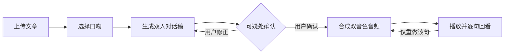

# 「对白」项目方案

> 来源：实验2《个人软件选题与需求分析》。章节编号沿用原报告。

### 2.1 选题来源与问题陈述

#### 2.1.1 问题陈述（表1）

**表1 问题陈述五要素**

| 要素 | 内容 |
| --- | --- |
| 目标用户 | 在校大学生，尤其是有大量阅读材料需要消化、且碎片时间较多的人（本人为代表用户） |
| 当前情境 | 通勤、睡前、做家务等场景中，眼睛与双手被占用，希望利用这段时间摄入知识性内容 |
| 主要困难 | 静下来读一篇文章需要连续注意力，难以在碎片时间完成；改用语音朗读后，机器念稿语调平直、没有停顿与互动，听到三五分钟即走神；而现成播客的内容又未必与自己手上的材料对应 |
| 造成影响 | 收藏的文章长期未读；想学的内容始终没有真正进入记忆；碎片时间被低信息量内容占据 |
| 拟解决方式 | 把一篇文章改写为两个人的口语对话，按用户指定的口吻组织，再合成为双音色音频，使内容可以用耳朵轻松听完 |

> **说明**：本项目的核心不是"把文章转成语音"，而是"把文章改写成一场可以听的对话"。二者的区别见 2.5.1。

#### 2.1.2 选题来源与证据

本题目的来源由三条证据支撑。

**记录1：本人真实经历**

本人在准备课程材料期间，习惯把 PDF 与网页文章保存进收藏夹，计划"有空再看"。实际统计本人近一个月的收藏记录，共保存 27 篇材料，其中完整读完的为 4 篇，多数停留在开头两三段。随后尝试用手机自带的文本朗读功能在通勤时收听，遇到的具体障碍是：朗读语调平直、无停顿变化，且遇到括号与编号时会逐字念出，听感断裂；单次收听通常不超过 3 分钟即中断。

**记录2：公开需求材料**

Google 在介绍 NotebookLM 音频概览功能的官方博客中说明，加入音频能力的动因是"我们知道有些人通过听对话能学得更好、记得更牢"（"we know some people learn and remember better by listening to conversations"）。该表述与记录1中观察到的现象一致，说明"以对话形式收听内容"存在真实且非个例的需求。

- 来源：Google 官方博客《NotebookLM now lets you listen to a conversation about your sources》
- 链接：https://blog.google/technology/ai/notebooklm-audio-overviews
- 访问日期：2026-09-28

**记录3：简短访谈（待执行）**

已设计访谈提纲（见表20），计划访谈 2 位同学（同学A、同学B），围绕"是否使用过语音或播客形式学习""放弃收听的原因"两个方面收集一手材料。**本节访谈结果待执行后补录**，包括访谈时间、被访者匿名代号与回答摘要。

#### 2.1.3 核心价值与使用前后的可观察变化

**核心价值（一句话）**：

> **「对白」——把文章，聊给你听。**

**表2 使用前后对比**

| 维度 | 使用前 | 使用后（可观察的变化） |
| --- | --- | --- |
| 单篇文章的完成率 | 收藏 27 篇，读完 4 篇 | 已生成音频的文章可完整听完 |
| 收听体验 | 机器念稿，语调平直，遇括号与编号逐字念出 | 两个人对话，有停顿、有追问、有语气变化 |
| 姿势与场景 | 需坐着看屏幕 | 可单手操作，锁屏可播，走路与做家务时可用 |
| 听到不懂处 | 需停下查找，一停就断 | 原文段落号可回溯，文字稿逐句高亮 |
| 时长匹配 | 文章长度固定，无法适配通勤时长 | 可指定目标时长（二期） |

---

### 2.2 用户画像与典型场景

#### 2.2.1 主要用户画像

**表3 用户画像卡**

| 维度 | 描述 |
| --- | --- |
| 身份 | 在校大学生（本科，非计算机专业亦可） |
| 目标 | 利用通勤、睡前、做家务等碎片时间摄入知识性内容，并真正记住 |
| 能力 | 熟悉手机与电脑的基础操作；不需要任何技术背景；能接受"上传文件—选选项—播放"三步交互 |
| 使用环境 | 地铁与公交（约 20—40 分钟）、睡前床上、做家务时；环境噪声较高；多数时候只有单手可操作，或不方便看屏幕 |
| 约束 | 时间碎片化（单次 10—30 分钟）；注意力易被打断；移动网络不稳定；对流量与时长敏感 |
| 痛点 | ①现有朗读工具语调机械，听着走神；②括号、编号、图表引用被逐字念出，听感断裂；③现成播客内容与自己的材料不对应；④读完之后讲不出内容讲了什么 |

**次要用户**：内容提供者（如任课教师、小组组长），希望把自己手上的一份讲义或材料转成音频，分享给同学收听。次要用户的使用流程与主要用户一致，区别在于更关注"多人收听"与"术语读法正确"。

#### 2.2.2 正常场景（表4）

**表4 正常场景（4 个）**

| 编号 | 场景 | 用户动作 | 系统响应 |
| --- | --- | --- | --- |
| S1 | 早高峰地铁，约 20 分钟 | 上传一篇 3000 字的课程文章，选择"抬杠"口吻，点击生成 | 生成双人对话稿与音频；用户戴上耳机播放，屏幕锁闭仍可继续收听 |
| S2 | 睡前躺在床上，不想看屏幕 | 选择"老少"口吻生成并播放，音量调低 | 音频以温和语气呈现；播放器支持 15 分钟后自动停止 |
| S3 | 做家务，双手被占用 | 从历史记录中打开已生成的内容直接播放 | 支持锁屏播放、断点续播；无需触碰屏幕即可从上次中断处继续 |
| S4 | 听到某个数字想核对 | 停下音频，打开文字稿，点击可疑的那句 | 显示该句对应的原文段落号与原句，便于核对 |

#### 2.2.3 异常场景（表5）

**表5 异常场景（3 个）**

| 编号 | 异常情况 | 系统应如何响应 |
| --- | --- | --- |
| E1 | 文章以表格、公式、图表为主（如数据报告） | **不直接生成**，提示"本篇不适合转为音频"并说明原因（表格与公式无法朗读），建议改为文字摘要；用户可强制继续 |
| E2 | 语音合成服务不可用（超时或额度耗尽） | 自动降级：输出并保存完整文字稿，明确提示"音频暂不可用，可稍后重试"，本次已生成内容不丢失 |
| E3 | 生成结果中某个专业术语读法不确定 | 将该项标记为"待确认"，**在用户确认前不合成该句音频**；用户可选择保留原文读法或填入正确读法后仅重做该句 |

---

### 2.3 现有方案与差异化

#### 2.3.1 现有方案调研

本实验要求调研至少 2 个现有相似的产品、人工流程或开源方案。本节覆盖三类，共 3 个对象。

**方案一：NotebookLM Audio Overview（商业 AI 产品）**

Google 的 NotebookLM 提供音频概览功能，可将上传的 PDF、Docs、网页、YouTube 转录等内容生成两个 AI 主持人的对话音频。其能力包括：格式选择（深入对谈、简版、批判分析、双人辩论）、输出语言选择、自定义指令、播放中可打断提问（Interactive Mode），并提供文字稿。

- 来源：Google 官方博客；NotebookLM 使用指南
- 链接：https://blog.google/technology/ai/notebooklm-audio-overviews
- 访问日期：2026-09-28

**方案二：人工有声书与播客制作（人工流程）**

由作者或团队撰写对话脚本、录音、剪辑后发布。质量上限高、语气自然，但单篇制作需要数小时的撰稿与录制，且必须由真人完成，无法针对个人手上的单篇文章按需生产。

**方案三：开源自建方案（开源方案）**

以开源语音合成模型（如 CosyVoice 3、Qwen3-TTS）搭配大语言模型自行搭建。可本地部署、数据不出本机、无按量计费，但需要自行完成模型部署、提示词工程、音频拼接等全部工程工作，对非技术用户门槛高。

#### 2.3.2 三维对比（表6）

**表6 现有方案三维对比**

| 维度 | NotebookLM Audio Overview | 人工有声书与播客 | 开源自建方案 | 本项目 |
| --- | --- | --- | --- | --- |
| 功能 | 多源输入，可生成双人对话音频，支持格式与语言选择、播放中提问 | 可完全定制脚本与语气 | 能力取决于自建程度，需自行实现 | 单篇输入，生成双人口语对话音频，口吻可选 |
| 成本 | 免费额度内可用；超量按量计费 | 单篇需数小时人工，成本最高 | 无按量费用，但需本地算力与开发工时 | 语音合成 1.3 元/千字，3000 字约 4 元 |
| 隐私 | 内容需上传至第三方服务 | 内容不离开制作者 | 可完全本地，隐私最好 | 默认上传云端；提供本地模型降级路径 |
| 易用性 | 网页操作，较易上手 | 需录音剪辑能力 | 门槛最高，需技术背景 | 三步操作：上传、选口吻、播放 |
| AI 能力 | 强，含格式选择与交互问答 | 无 AI | 取决于自建 | 强，且口吻可参数化并贯穿文本与语音两层 |
| **可否修改生成结果** | **不可编辑**，只能改指令后整篇重新生成 | 可重新录制 | 取决于实现 | **可定位到单句修改，仅重做该句** |

#### 2.3.3 本项目不准备解决的问题（边界）

- **不做多文档综述**：仅处理用户上传的单篇文章，不追求跨材料归纳。
- **不做实时打断问答**：不实现播放中提问并即时回答的能力。
- **不做语音克隆与自定义音色**：涉及隐私与伦理风险，本课程周期内不纳入。
- **不做视频与数字人**：仅输出音频与文字稿。
- **不做跨语言翻译**：仅处理中文内容。
- **不做内容平台**：不提供内容库，只处理用户自己拥有的材料。
- **不替代原文阅读**：本项目定位为"第二遍"，供收听与复习，不替代精读。

#### 2.3.4 可借鉴的设计与仍未解决的问题

**可借鉴**：

1. NotebookLM 采用"仅基于用户上传材料作答"（source-grounded）的策略，可有效抑制模型自由发挥；
2. 双主持人对话形式——两人对谈比单人朗读更耐听，这是本项目"两个人"设定的直接依据；
3. 提供文字稿——听觉容易遗漏，文字稿是必要补充。

**仍未解决**：NotebookLM 生成的音频**无法编辑**，用户发现某句读错时，只能修改指令后整篇重新生成，耗时且可能引入新的不一致。对专业内容（术语、数字）而言，这一限制直接影响可用性。

**本项目准备形成的差异**：把可编辑的文字稿作为一等产物，支持**定位到单句修改、仅重做该句**，而其余内容保持不变。

---

### 2.6 MVP 范围与第 2—17 周计划

#### 2.6.1 一页个人项目方案

**项目名称**：「对白」——把文章，聊给你听

**本学期只重点完成的一条核心用户流程**：

> **上传一篇文章 → 选择口吻 → 生成双人对话稿 → 确认可疑处 → 合成双音色音频 → 播放并逐句回看**

**图2 核心用户流程图**：本学期的 MVP 只打通这一条路径。其中"可疑处确认"环节是唯一的人工确认点，可返回修改后重新生成；播放阶段允许定位到单句并仅重做该句音频，其余内容不受影响。

**表17 MVP 范围（本学期实现）**

| 功能 | 说明 |
| --- | --- |
| 单篇文章上传 | 支持 Markdown 与 txt，自动给段落编号 |
| 6 种固定口吻 | 师生、抬杠、老少、访谈、播客对谈、睡前 |
| 对话稿生成 | 结构化输出，每句带原文段落号 |
| 听觉可用性校验 | 自动检查并清除括号、编号、图表引用 |
| 可疑处标记与确认 | 术语、数字、无出处句进入待确认列表 |
| 单句修正 | 修改一句，仅重新合成该句 |
| 音频合成与播放 | 双音色；锁屏播放；断点续播；逐句高亮 |

**明确不在本学期实现的功能**：

- 多文档综述与跨文档串联
- 播放中实时打断问答
- 术语即点即解插播（二期）
- 按目标时长生成（二期）
- 多角色自动生成（角色数量由内容决定，二期）
- 语音克隆与自定义音色
- 用户账号体系与口吻分享社区
- 移动端 App、视频与数字人

#### 2.6.2 阶段划分、可运行成果、验收条件与风险（表18）

**表18 四阶段计划**

| 阶段 | 周次 | 可运行成果 | 验收条件 | 主要风险 |
| --- | --- | --- | --- | --- |
| 阶段一：需求与方案 | 第2—5周 | 需求说明V1；用例与验收条件；原型界面 | 2.4 的用例与验收示例可复核 | 选题范围失控；以 2.3.3 边界清单约束 |
| 阶段二：对话稿生成 | 第6—9周 | 输入文章可得双人对话稿（文字） | 括号残留 0；每句有段落号；6 种口吻输出可区分 | 口吻一致性不达标；口吻从 6 种减至 3 种 |
| 阶段三：音频链路 | 第10—13周 | 对话稿可合成为可播放音频 | 双音色可区分；首段 3 秒内出声 | 合成成本超预算；限 3000 字以内或降级本地模型 |
| 阶段四：修正与验收 | 第14—17周 | 完整流程与验收报告 | 单句修正仅影响该句；全部验收示例通过 | 时间不足；将术语插播、时长控制移出 MVP |

#### 2.6.3 第 2—17 周周计划（表19）

**表19 第 2—17 周周计划**

| 周次 | 可检查任务 | 阶段演示节点 |
| --- | --- | --- |
| 第2周 | 完成选题调研：竞品三维对比、证据收集 | — |
| 第3周 | 完成问题陈述与用户画像 | — |
| 第4周 | 完成用户故事、用例与验收条件 | 演示1：需求说明V1 |
| 第5周 | 完成 AI 必要性与可行性分析；确定 MVP 边界 | — |
| 第6周 | 搭建项目骨架；实现文章上传与段落编号 | — |
| 第7周 | 实现对话稿生成（结构化输出） | — |
| 第8周 | 实现听觉可用性校验（括号、编号、图表引用清除） | 演示2：输入文章得到对话稿 |
| 第9周 | 实现 6 种口吻并调优一致性 | — |
| 第10周 | 接入语音合成，实现双音色分配 | — |
| 第11周 | 实现音频拼接与响度归一化 | — |
| 第12周 | 实现播放器（锁屏、续播、逐句高亮） | 演示3：完整音频播放 |
| 第13周 | 实现可疑处标记与确认流程 | — |
| 第14周 | 实现单句修正与重合成 | — |
| 第15周 | 按 2.4.5 的验收示例逐项测试 | 演示4：核心流程演示 |
| 第16周 | 修复缺陷；编写使用说明 | — |
| 第17周 | 完成验收报告与项目文档 | 演示5：最终验收 |

#### 2.6.4 延期与删减预案（表20）

**表20 延期与删减预案**

| 风险 | 触发条件 | 删减或替代方案 |
| --- | --- | --- |
| 口吻一致性不达标 | 第 9 周检查中，角色措辞一致率低于 80% | 口吻由 6 种减至 3 种（师生、抬杠、老少），保留质量最好的组合 |
| 语音合成成本过高 | 单篇合成费用超出预算 | 降低单篇字数上限至 2000 字，或改用本地开源模型 |
| 进度落后于计划 | 第 12 周仍未跑通音频链路 | 将术语插播、时长控制移出 MVP，写入二期计划 |
| 文章解析不稳定 | 上传失败率高于 10% | 收窄输入格式，仅支持 Markdown 与纯文本 |

---

## 4. 实验小结

### 4.1 最终选题

**「对白」——把文章，聊给你听。** 一句话概括核心：给一篇没有"人"的文章，指派两个具体的人，用他们各自的口气把它说一遍。

核心由三个要素构成，缺一不可：**文章**（输入源）、**两个人的对话**（输出形态）、**口吻**（核心控制变量）。去掉口吻，产品就退化为格式转换器，AI 必要性也随之消失。

### 4.2 核心用户流程与 MVP 边界

核心用户流程（本学期只完成这一条）：**上传文章 → 选口吻 → 生成双人对话稿 → 确认可疑处 → 合成双音色音频 → 播放并逐句回看**。

MVP 边界明确：本学期实现上传、6 种口吻、对话稿生成、听觉可用性校验、可疑处确认、单句修正、音频合成与播放；**明确不做**多文档综述、实时打断问答、术语插播、时长控制、多角色生成、语音克隆、账号体系与移动端。

### 4.3 AI 能力的必要性

AI 在本项目中承担四项无法规则化的判断：听觉可用性改写、口吻一致性维持、时长取舍、是否适合转音频。其中最强的论据是——**"口吻"同时作用于文本层（改写台词）与语音层（情绪指令）**，需同时操控两层的表达风格，模板与规则均无从下手。

同时，本项目保留了三级非 AI 降级方案，确保在服务不可用时仍能部分交付。

### 4.4 需求变化与取舍说明

本次分析中发生了两次明确的需求取舍（详见表23）：

1. **CH1（定位修正）**：从"AI 决定问什么"（内容层）调整为"AI 决定怎么说"（口吻层）。原因是内容层的一问一答同样可用规则实现，无法支撑 AI 必要性论证。
2. **CH2（机制修正）**：把"可编辑对话稿"从主要卖点调整为"补救通道"。原因是产品定位为"放松时听"，若编辑成为必经步骤，将与"省力"的核心定位冲突。

此外，为控制范围，明确砍掉了术语即点即解、按目标时长生成、多角色自动生成三项差异化功能，改为写入二期计划——这三项差异度高，但会显著增加本学期工作量。

---

*报告生成日期：2026-09-28*
