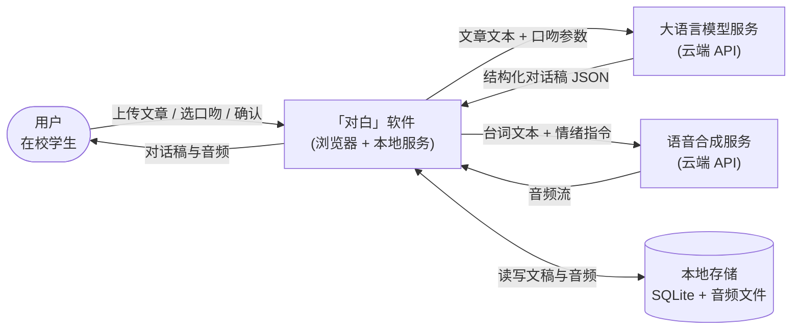
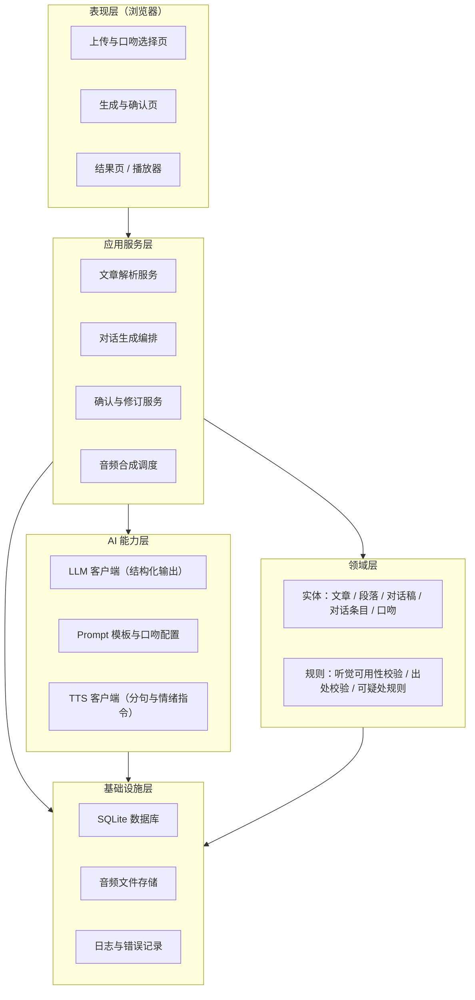
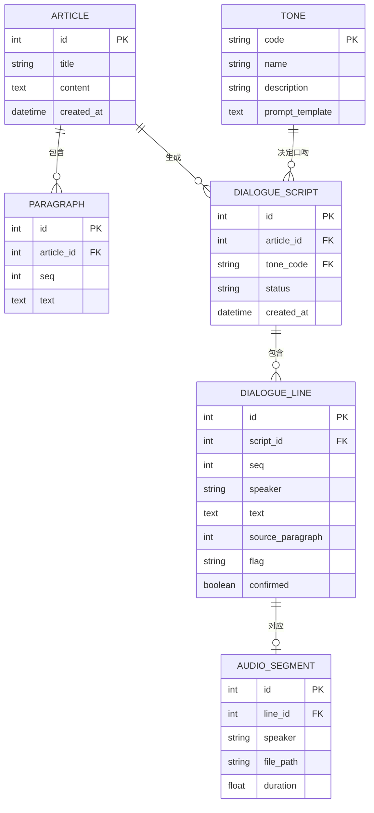
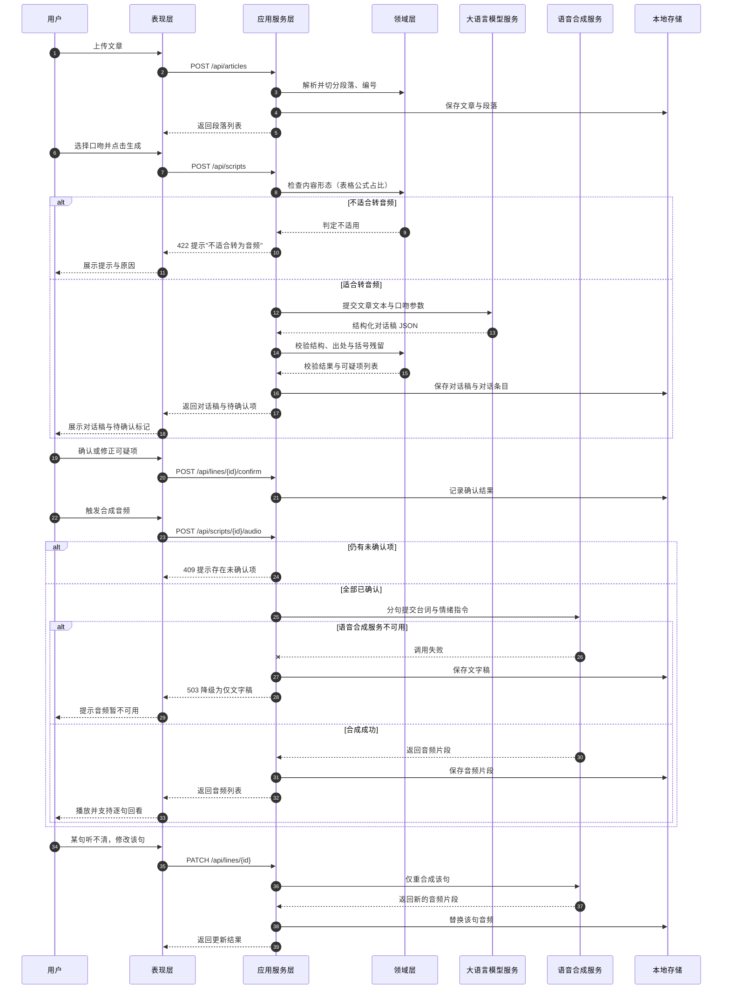
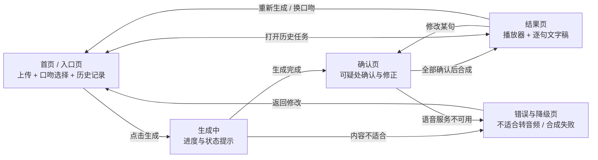

# 实验3 报告：软件架构与界面设计

## 学习通提交说明

| 项目 | 信息 |
| --- | --- |
| 班级 | 24软件工程 |
| 学号 | 24111302137 |
| 姓名 | 王浩然 |
| 提交平台 | 学习通 |
| 截止时间 | 以学习通作业设置为准 |
| 实验日期 | 2026-09-28 |

**文件命名**：`24软件工程-24111302137-王浩然-实验3-软件架构与界面设计.pdf`

**PDF内容**：需求与设计对应表、技术选型与架构决策、软件与外部环境关系图、总体架构图与模块说明、数据与接口设计、核心流程图、关键界面原型、设计检查记录及仓库版本证据。

**过程核验**：报告中的仓库链接与 Commit 用于过程核验；设计文件保存于 `docs/design/` 目录。

**报告结构**：1. 实验目的；2. 实验内容与操作记录（2.1—2.6）；3. 操作记录；4. 实验小结。所有图均编号并配有说明文字。

**隐私与安全说明**：本项目不采集个人敏感信息；用户上传的文章内容默认仅保存在本地，不用于模型训练；报告不展示任何账号密码、访问令牌或密钥。

---

## 1. 实验目的

1. 把实验2的需求说明转化为可指导后续开发的软件架构、模块边界、数据模型、接口和交互方案。
2. 形成与个人能力匹配的技术选型，并保留关键决策依据。
3. 完成关键设计，检查需求、架构与界面之间是否一致，为实验4的软件基础功能开发提供设计基线。

---

## 2. 实验内容与操作记录

### 2.1 需求输入与设计范围

#### 2.1.1 选定的核心用户流程

本项目为「对白」——把文章聊给你听。按实验2的结论，本学期只打通一条核心用户流程：

> **上传一篇文章 → 选择口吻 → 生成双人对话稿 → 确认可疑处 → 合成双音色音频 → 播放并逐句回看**

该流程对应的需求输入汇总于表1。

**表1 核心流程对应的需求输入**

| 类别 | 编号 | 内容摘要 | 来源 |
| --- | --- | --- | --- |
| 用户故事 | US1 | 想在通勤路上利用时间的学生，希望把文章变成两个人聊天的音频，以便不用盯着屏幕也能听懂 | 实验2 表7 |
| 用户故事 | US2 | 会反复听同一篇文章的人，希望换一种口吻重新生成 | 实验2 表7 |
| 用户故事 | US3 | 需要记住专业术语的人，希望听到某句时能核对原文对应段落 | 实验2 表7 |
| 功能需求 | UC1 | 上传单篇文章并自动给段落编号 | 实验2 表9 |
| 功能需求 | UC2 | 从 6 种预设口吻中选择一种 | 实验2 表9 |
| 功能需求 | UC3 | 生成双人口语对话，每句带原文段落号 | 实验2 表9 |
| 功能需求 | UC4 | 点击任一句显示对应原文段落 | 实验2 表9 |
| 功能需求 | UC5 | 修改某句后仅重新合成该句音频 | 实验2 表9 |
| 功能需求 | UC6 | 按角色分配不同音色合成音频 | 实验2 表9 |
| 非功能需求 | NFR1 | 3000 字文章的对话稿生成不超过 60 秒；音频合成不超过 90 秒 | 实验2 表10 |
| 非功能需求 | NFR2 | 点击播放后 3 秒内开始出声（流式合成） | 实验2 表10 |
| 非功能需求 | NFR5 | 上传内容仅用于本次生成，不用于训练；文稿与音频默认保存在本地 | 实验2 表10 |
| 非功能需求 | NFR6 | 支持锁屏播放与断点续播；文字稿支持逐句高亮 | 实验2 表10 |
| 验收条件 | AC1 | 3000 字文章 60 秒内产出对话稿与音频，且文本中无括号、编号、图表引用 | 实验2 表8 |
| 验收条件 | AC3 | 表格公式为主的文章应提示"不适合转为音频"，不直接生成 | 实验2 表8 |
| 验收条件 | AC4 | AI 标记的术语不确定项须经用户确认后才合成音频 | 实验2 表8 |
| 验收条件 | AC5 | 语音合成不可用时输出完整文字稿并提示 | 实验2 表8 |

#### 2.1.2 需求与设计双向追踪对应表

按双向追踪原则建立对应表（表2）。每一行表示：该需求在本设计中由哪些内容承载，以及可由哪张图或哪份文档查证；反向亦可从设计内容追溯需求来源。

**表2 需求—设计双向追踪对应表**

| 需求编号 | 准备完成的设计内容 | 对应图或文档 | 负责模块 |
| --- | --- | --- | --- |
| US1 | 对话生成与音频合成的完整链路设计 | 图2、图5、图9 | 应用服务层、AI 能力层 |
| US2 | 口吻作为可切换参数的设计 | 图2、图7、表10 | 领域层（Tone）、AI 能力层 |
| US3 | 对话条目携带原文段落号的数据设计 | 图4、图9、表10 | 领域层（DialogueLine） |
| UC1 | 文章解析与段落编号 | 图5、表11 | 应用服务层 |
| UC2 | 口吻选择界面与参数传递 | 图7、表11 | 表现层、应用服务层 |
| UC3 | 结构化输出的接口约束 | 图5、表11、表12 | AI 能力层 |
| UC4 | 出处回溯的查询接口与界面 | 图9、表11 | 应用服务层、表现层 |
| UC5 | 单句修正与局部重合成 | 图5、图8、表11 | 应用服务层 |
| UC6 | 双音色分配与音频合成 | 图2、图5 | AI 能力层 |
| NFR1 | 任务异步化与进度反馈 | 图5、图8 | 应用服务层 |
| NFR2 | 流式合成与首段优先返回 | 图5、图9 | AI 能力层、表现层 |
| NFR5 | 本地存储与数据边界 | 图1、图2、表10 | 基础设施层 |
| NFR6 | 播放器与逐句高亮 | 图9 | 表现层 |
| AC1 | 听觉可用性校验规则 | 图3、表11 | 领域层 |
| AC3 | 内容形态判断与拒绝提示 | 图5、图8 | AI 能力层 |
| AC4 | 可疑处标记与人工确认环节 | 图5、图8、表9 | 领域层、表现层 |
| AC5 | 语音合成失败降级 | 图5、表8 | 应用服务层 |

#### 2.1.3 普通软件功能与 AI 功能的边界

按实验要求，本阶段只划分职责边界，不确定 RAG、Agent 等具体实现方法。

**表3 普通软件功能与 AI 功能边界**

| 任务 | 归属 | 理由 |
| --- | --- | --- |
| 文章解析与段落编号 | 普通程序 | 结果为确定的编号序列，正则与解析器即可完成 |
| 是否需要转音频的前置判断 | AI（初判）+ 程序（阈值） | 需理解内容形态；表格与公式占比可由程序量化 |
| 生成双人对话稿 | AI | 需语义理解与语言重组，规则无法覆盖 |
| 听觉可用性校验（括号、编号、图表引用残留） | 普通程序 | 残留检测为确定规则，检测结果可精确判定 |
| 可疑处标记（术语、数字、无原文依据句） | AI（提出候选）+ 程序（兜底规则） | 术语识别需语义判断；数字变化与空出处可用程序检出 |
| 内容忠实性校验（是否有原文依据） | 普通程序 | 校验 `source_paragraph` 是否为空，规则可判定 |
| 排除用户已确认项 | 用户 | 人工确认点，程序只记录结果 |
| 语音合成 | AI（模型服务） | 由外部语音合成服务完成 |
| 音频拼接与响度归一化 | 普通程序 | 由 FFmpeg 等工具完成，逻辑确定 |
| 单句修正后的局部重合成 | 普通程序 | 定位与调度为确定逻辑 |
| 播放控制与逐句高亮 | 普通程序 | 前端播放器行为 |

**边界结论**：核心链路中，AI 只负责"理解与生成"（判断是否适合转音频、生成对话稿、标记可疑处、语音合成），其余环节均由普通程序承担。**所有 AI 产出都必须经过程序校验或用户确认之后才能进入下一步。**

---

### 2.2 技术选型与架构决策

#### 2.2.1 候选方案比较

**表4 技术方案比较**

| 维度 | 方案A：Next.js 全栈（TypeScript） | 方案B：前端 + Python FastAPI | 方案C：本地桌面应用（Python + PyQt） |
| --- | --- | --- | --- |
| 本人熟悉程度 | 中（有 Web 基础） | 高（Python 最熟） | 中 |
| 实现成本 | 低（前后端一体，无需分别部署） | 中（需维护两个工程与联调） | 中（界面开发量大） |
| 框架生态 | 强（React 生态、组件丰富） | 强（AI SDK 最全） | 弱 |
| AI 接入 | 好（Node SDK 可用） | 最好（Python 生态原生） | 好 |
| 测试 | 好（Jest / Playwright） | 好（pytest） | 一般 |
| 运行环境 | 浏览器，跨平台 | 需同时运行前后端 | 仅本机 |
| 结论 | **采用** | 备选 | 不采用 |

#### 2.2.2 设计决策说明（ADR）

**表5 ADR-1：开发语言与框架**

| 项目 | 内容 |
| --- | --- |
| 要解决的问题 | 用何种语言与框架实现前后端，兼顾一人开发与 AI 接入 |
| 考虑过的方案 | 方案A：Next.js 全栈（TypeScript）；方案B：前端 + Python FastAPI；方案C：本地桌面应用 |
| 最终选择 | **方案A：Next.js 15（App Router）+ React 19 + TypeScript** |
| 理由 | ①前后端一体，一个工程即可完成，明显降低一人的维护成本；②播放器与逐句高亮等交互密集功能适合 React 组件化实现；③Node 侧可调用大模型与语音合成接口，满足 AI 接入需求；④实验2 已选定该技术栈，保持一致 |
| 可能的不足 | Python 侧 AI SDK 生态更完整，本方案在模型调试上便利性略低；若后续需要本地模型推理，需额外搭建服务 |

**表6 ADR-2：数据保存方式**

| 项目 | 内容 |
| --- | --- |
| 要解决的问题 | 文章、对话稿、音频片段保存在哪里 |
| 考虑过的方案 | ①SQLite 本地文件库；②PostgreSQL 或 Supabase 等云端数据库；③纯 JSON 文件 |
| 最终选择 | **①SQLite（元数据）+ 本地文件系统（音频）** |
| 理由 | ①单人项目、数据量小，无需运维数据库服务；②音频为二进制大对象，存文件系统更合适；③符合 NFR5"默认保存在本地"的隐私要求 |
| 可能的不足 | 多端访问不便；后续若需云端同步，需要迁移方案 |

**表7 ADR-3：软件体系结构风格**

| 项目 | 内容 |
| --- | --- |
| 要解决的问题 | 采用何种体系结构风格组织代码 |
| 考虑过的方案 | ①分层架构；②MVC；③事件驱动 |
| 最终选择 | **①分层架构**（表现层、应用服务层、领域层、AI 能力层、基础设施层），前端内部按组件划分 |
| 理由 | ①本项目的核心是"生成任务编排"，分层可清晰隔离外部依赖（模型服务易替换）；②AI 能力独立成层，便于按实验2 的降级方案替换实现；③单人开发时分层比 MVC 更易保持边界 |
| 可能的不足 | 层次较多，小功能改动可能需跨层修改；若后续引入复杂交互状态，可能需要在表现层内部再引入状态管理 |

#### 2.2.3 关键依赖的替代方案

**表8 关键依赖与替代方案**

| 关键依赖 | 主选 | 替代方案 | 切换代价 |
| --- | --- | --- | --- |
| 大语言模型服务 | 云端大模型 API（结构化输出） | 本地部署开源模型 | 中（需自建推理服务，输出质量可能下降） |
| 语音合成服务 | 火山引擎豆包 Seed-TTS 2.0（中文自然度较好，支持指令式情绪控制） | 本地部署 CosyVoice 3（需 8GB 显存）；或降级为仅输出文字稿 | 中（本地部署需算力；降级后失去"可听"） |
| 数据存储 | SQLite | PostgreSQL / Supabase | 低（数据量小，迁移简单） |
| 主要框架 | Next.js 15 | Vite + React + Node 服务 | 中（需拆分工程并调整构建） |

---

### 2.3 软件架构与模块设计

#### 2.3.1 软件与外部环境关系图



**图1 软件与外部环境关系图**：用户为在校学生；「对白」软件本身包含浏览器界面与本地服务两部分；大语言模型服务与语音合成服务均为**外部依赖**，以云端 API 方式调用（实施时若切换为本地模型，则改由本机推理服务承担，图中位置相应移入本地）。本地存储保存文章、对话稿与音频文件，属于本软件自身的数据边界，不对外共享。

#### 2.3.2 软件总体架构图



**图2 软件总体架构图**：采用分层架构。**表现层**负责页面与交互；**应用服务层**负责流程编排（解析、生成、确认、合成）；**领域层**保存核心实体与校验规则；**AI 能力层**封装所有对外部模型的调用，是唯一与模型服务直接交互的层；**基础设施层**提供存储与日志。依赖方向自上而下，AI 能力层与基础设施层不反向依赖表现层，从而保证模型服务可被替换（对应表8 的替代方案）。

#### 2.3.3 模块职责与依赖关系


**图3 模块依赖与数据流向图**：展示核心流程中数据在各模块之间的流动顺序。数据从用户输入开始，经解析落库为段落数据；再由 Prompt 组装提交模型生成，生成结果必须通过结构、出处与括号残留三项校验后才能落库为对话稿；对话稿须经用户确认才进入语音合成，合成结果落为音频片段供播放。图中最后一条回边对应"单句修正后仅重做该句"。

**表9 模块职责与依赖关系**

| 模块 | 主要职责 | 依赖 | 被谁依赖 |
| --- | --- | --- | --- |
| 上传与口吻选择页 | 收集文件与口吻参数，展示历史记录 | 应用服务层 API | —（入口） |
| 生成与确认页 | 展示生成进度，列出可疑处供用户确认或修正 | 应用服务层 API | — |
| 结果页 / 播放器 | 播放音频、逐句高亮、展示原文出处 | 应用服务层 API、音频文件 | — |
| 文章解析服务 | 解析上传文件，切分段落并编号 | 基础设施层 | 应用服务层内部 |
| 对话生成编排 | 组装 Prompt、调用 LLM、校验输出、持久化 | AI 能力层、领域层、基础设施层 | 表现层 |
| 确认与修订服务 | 记录确认结果、处理单句修正与局部重合成 | 领域层、AI 能力层 | 表现层 |
| 音频合成调度 | 分句调用 TTS、拼接、响度归一化 | AI 能力层、基础设施层 | 表现层 |
| 领域实体与规则 | 定义数据结构与校验规则（听觉可用性、出处、可疑处） | — | 应用服务层 |
| LLM 客户端 | 封装模型调用与结构化输出校验 | Prompt 模板 | 对话生成编排 |
| TTS 客户端 | 封装语音合成、音色分配、情绪指令 | — | 音频合成调度、确认与修订服务 |
| 存储与日志 | 读写数据库与音频文件、记录运行日志 | — | 各层 |

**表10 用户—普通程序—模型—工具职责划分表**

| 核心流程环节 | 用户 | 普通程序 | 模型 | 外部工具或服务 | 由谁检查 AI 结果 |
| --- | --- | --- | --- | --- | --- |
| 上传与解析 | 上传文件 | 解析、切分段落、编号 | — | — | — |
| 内容形态判断 | — | 统计表格公式占比并套用阈值 | 判断是否适合转音频 | — | 程序（阈值）+ 用户（采纳提示） |
| 生成对话稿 | 选择口吻 | 组装 Prompt、校验 JSON 结构 | 生成双人对话 | 大语言模型服务 | **程序（结构、出处、括号残留）+ 用户（可疑处）** |
| 听觉可用性校验 | — | 检测并清除括号、编号、图表引用 | — | — | 程序 |
| 可疑处确认 | 确认或修正 | 记录确认结果，拦截未确认项 | 标注可疑处 | — | 用户 |
| 音频合成 | 触发合成 | 分句、分配音色、调度与拼接 | 合成语音 | 语音合成服务 | 程序（时长与静音检测） |
| 播放与回看 | 收听、点击某句 | 播放控制、逐句高亮、出处定位 | — | 浏览器播放器 | 用户 |
| 单句修正 | 修改某句 | 定位并仅重合成该句 | 合成该句语音 | 语音合成服务 | 用户 |

---

### 2.4 数据、接口与核心流程设计

#### 2.4.1 核心数据模型



**图4 核心数据模型图（ER 图）**：一篇文章包含多个段落（`PARAGRAPH`），段落编号 `seq` 是出处回溯的基础；一篇文章可生成多份对话稿（对应"换一种口吻重听"），每份对话稿由多条对话条目组成；每条对话条目通过 `source_paragraph` 指向原文段落，通过 `flag` 标记可疑类型（术语、数字、无出处），`confirmed` 记录用户是否已确认；`AUDIO_SEGMENT` 与对话条目一对一，支持"仅重做该句"。

**表11 核心数据对象与字段说明**

| 数据对象 | 关键字段 | 约束 | 是否需保存 | 是否敏感 |
| --- | --- | --- | --- | --- |
| Article | id、title、content、created_at | title 非空 | 是 | 否（用户自有资料） |
| Paragraph | article_id、seq、text | seq 在文章内唯一且连续 | 是 | 否 |
| DialogueScript | article_id、tone_code、status、created_at | tone_code 必须来自 Tone 表 | 是 | 否 |
| DialogueLine | script_id、seq、speaker、text、source_paragraph、flag、confirmed | speaker 取值限定为两个角色；source_paragraph 必须指向本文已有段落；flag 为空表示无疑点 | 是 | 否 |
| Tone | code、name、description、prompt_template | code 为主键，共 6 条预置 | 是 | 否 |
| AudioSegment | line_id、speaker、file_path、duration | 与 DialogueLine 一对一 | 是（文件形式） | 否 |

**敏感数据说明**：本项目不采集账号、手机号、位置等个人信息；唯一的用户数据是**用户自行上传的文章内容**，默认存放于本机 SQLite 与本地目录，不上传至除模型服务与语音合成服务之外的其他系统，且不用于模型训练（对应 NFR5）。

#### 2.4.2 接口设计

**表12 主要接口清单**

| 接口 | 提供模块 | 调用方 | 用途 | 输入 | 输出 | 失败情况 |
| --- | --- | --- | --- | --- | --- | --- |
| POST /api/articles | 应用服务层 | 前端 | 上传并解析文章 | 文件或 Markdown 文本 | article_id、段落列表 | 文件过大、编码不支持、内容为空 |
| POST /api/scripts | 应用服务层 | 前端 | 生成对话稿 | article_id、tone_code | script_id、状态 | 模型超时、结构化输出不合规、内容不适合转音频 |
| GET /api/scripts/{id} | 应用服务层 | 前端 | 获取对话稿 | script_id | 对话条目列表 | 记录不存在 |
| PATCH /api/lines/{id} | 应用服务层 | 前端 | 修正单句台词 | 新的 text | 更新后的条目 | 条目不存在、超出长度限制 |
| POST /api/lines/{id}/confirm | 应用服务层 | 前端 | 确认可疑处 | 确认结果 | 确认后的条目 | 该条目未被标记为待确认 |
| POST /api/scripts/{id}/audio | 应用服务层 | 前端 | 合成音频 | script_id | 音频片段列表 | 存在未确认项、语音合成服务不可用 |
| GET /api/audio/{segment_id} | 基础设施层 | 播放器 | 读取音频片段 | segment_id | 音频流 | 文件缺失 |
| GET /api/paragraphs/{id} | 应用服务层 | 前端 | 出处回溯 | paragraph_id | 段落原文 | 记录不存在 |

**表13 接口调用示例**

| 类型 | 场景 | 请求 | 响应 |
| --- | --- | --- | --- |
| 正常调用 | 生成对话稿 | `POST /api/scripts`，请求体：`{"article_id": 12, "tone_code": "teacher_student"}` | `200`，响应体：`{"script_id": 34, "status": "generated", "lines": 42, "pending_confirm": 2}` |
| 错误调用 | 文章以表格为主，不适合转音频 | `POST /api/scripts`，请求体：`{"article_id": 15, "tone_code": "teacher_student"}` | `422`，响应体：`{"error": "NOT_SUITABLE_FOR_AUDIO", "reason": "表格与公式占比 83%，无法朗读", "suggestion": "请改用文字摘要形式"}` |
| 错误调用 | 语音合成服务不可用 | `POST /api/scripts/34/audio` | `503`，响应体：`{"error": "TTS_UNAVAILABLE", "fallback": "text_only", "message": "音频暂不可用，文字稿已保存，可稍后重试"}` |
| 错误调用 | 存在未确认的可疑项 | `POST /api/scripts/34/audio` | `409`，响应体：`{"error": "PENDING_CONFIRMATION", "pending_line_ids": [201, 207]}` |

#### 2.4.3 核心任务流程设计



**图5 核心任务顺序图**：完整呈现"上传→生成→确认→合成→播放→单句修正"的过程。图中包含三处关键控制：①**内容形态判断**失败时直接返回提示，不进入生成；②**人工确认点**，存在未确认的可疑项时拒绝合成音频（返回 409）；③**语音合成失败的降级路径**，此时保存文字稿并明确提示，已生成内容不丢失。

---

### 2.5 界面原型与交互设计

#### 2.5.1 页面结构与导航关系



**图6 页面结构与导航关系图**：软件入口为首页，核心路径为"首页→生成中→确认页→结果页"。异常路径有两条：内容不适合转音频、语音合成不可用，均进入错误与降级页并提供返回修改的出口。结果页可返回确认页修改单句，也可返回首页换口吻重新生成。

#### 2.5.2 界面原型一：首页 / 入口页

**图7 首页 / 入口页原型**

```text
┌────────────────────────────────────────────────────────────┐
│  「对白」把文章，聊给你听                                    │
├────────────────────────────────────────────────────────────┤
│                                                            │
│  ┌──────────────────────────────────────────────────────┐  │
│  │                                                      │  │
│  │        拖拽文件到此处，或 点击选择文件               │  │
│  │        支持 Markdown / txt，单篇不超过 3000 字        │  │
│  │                                                      │  │
│  └──────────────────────────────────────────────────────┘  │
│                                                            │
│  选择口吻：                                                │
│  ( ) 师生   (•) 抬杠   ( ) 老少                            │
│  ( ) 访谈   ( ) 播客对谈   ( ) 睡前                        │
│                                                            │
│           [ 开始生成 ]            ← 未选文件时禁用（灰）    │
│                                                            │
├────────────────────────────────────────────────────────────┤
│  历史记录                                                   │
│  ┌──────────────────────────────────────────────────────┐  │
│  │ 光合作用.docx      抬杠    42 句   09-28 10:20  [播放]│  │
│  │ 数据报告.pdf       师生    —       09-28 09:55  [重试]│  │
│  └──────────────────────────────────────────────────────┘  │
│  （无记录时显示：还没有生成过内容，上传一篇文章试试）      │
└────────────────────────────────────────────────────────────┘
```

**图7 说明**：本页包含三类元素——**静态元素**（标题、说明文字、分区标题）、**用户输入元素**（文件拖拽区、口吻单选组）、**用户命令元素**（开始生成按钮）。交互约束：未选择文件时"开始生成"按钮置灰（禁用）；选择文件后按钮变为可用；点击后进入生成中状态。历史记录区展示每条任务的**口吻、句数、时间**，并提供"播放"或"重试"入口。**空数据状态**下显示引导文案，而非空白区域。

#### 2.5.3 界面原型二：核心任务页（生成与确认）

**图8 核心任务页原型**

```text
┌────────────────────────────────────────────────────────────┐
│  ← 返回        光合作用.docx · 抬杠口吻                      │
├────────────────────────────────────────────────────────────┤
│  [ 生成中 ]  已解析 6 段 · 正在生成对话稿…                  │
│  ████████████░░░░░░░░  56%        预计还需 20 秒            │
├────────────────────────────────────────────────────────────┤
│  待确认（2 项）    ← 人工确认点，必须处理后才可合成音频     │
│                                                            │
│  ⚠ 第 12 句 · 术语读法不确定                                │
│     "类囊体薄膜" 是否应读作"类囊体膜"？                     │
│     [ 保留原文读法 ]  [ 改为：________ ]                    │
│                                                            │
│  ⚠ 第 27 句 · 原文未支持                                    │
│     该句无可对应的原文段落，是否删除？                      │
│     [ 删除该句 ]  [ 保留并标记 ]                            │
│                                                            │
├────────────────────────────────────────────────────────────┤
│  对话稿预览（节选）                                         │
│  甲：叫"暗反应"？那我半夜把绿萝搬去没灯的地方…              │
│  乙：不是。原文 P1 说的是"不需要光直接参与"…                │
│                                                            │
│  [ 全部确认并合成音频 ]       [ 仅保存文字稿 ]              │
└────────────────────────────────────────────────────────────┘
```

**图8 说明**：本页承载两种状态。**加载状态**以进度条与剩余时间提示呈现；**人工确认状态**以待确认清单形式呈现，每条可疑项标注**类型**（术语读法 / 原文未支持）、**句序**、**具体问题**，并给出可执行操作（保留 / 修改 / 删除 / 标记）。交互约束：存在未确认项时，"全部确认并合成音频"按钮不可用，点击会收到 409 提示；用户也可以选择"仅保存文字稿"，直接走降级路径。

#### 2.5.4 界面原型三：结果页（播放与回看）

**图9 结果页原型**

```text
┌────────────────────────────────────────────────────────────┐
│  ← 返回        光合作用.docx · 抬杠口吻 · 42 句              │
├────────────────────────────────────────────────────────────┤
│  播放器                                                     │
│  ▶ ━━━━━━━━━●━━━━━━━━━━━━━━━  03:12 / 12:40                │
│  [ 上一句 ]  [ 暂停 ]  [ 下一句 ]   倍速 1.0x   音量 ▮▮▮   │
│  已支持：锁屏播放 · 断点续播                                │
├────────────────────────────────────────────────────────────┤
│  文字稿（当前句高亮）                                       │
│                                                            │
│  甲  叫"暗反应"？那我半夜把绿萝搬去没灯的地方…              │
│  乙  不是。原文 P1 说的是"不需要光直接参与"…   ← 正在播放   │
│      └ 出处：P1 点击查看原文    [ 修改这句 ] [ 重做这句 ]   │
│  甲  那中午太阳最猛，光合作用该最快吧？                     │
│  乙  原文 P6 说反而下降，这叫"光合午休"…                    │
│                                                            │
├────────────────────────────────────────────────────────────┤
│  [ 换一种口吻重新生成 ]   [ 导出文字稿 ]                    │
└────────────────────────────────────────────────────────────┘
```

**图9 说明**：本页是核心结果页，包含**动态元素**（播放进度、当前句高亮、时间显示）、**用户命令元素**（播放暂停、上一句下一句、修改这句、重做这句、换口吻重新生成、导出文字稿）。关键交互：点击"出处：P1"展开该段原文，实现出处回溯（US3）；点击"修改这句"进入单句修正，保存后**仅重做该句音频**，其余内容不变（UC5）；"换一种口吻重新生成"返回首页并保留当前文章（US2）。**错误状态**：音频片段缺失时，该句显示"音频不可用"，仍可阅读文字。

---

### 2.6 设计一致性检查与版本保存

#### 2.6.1 需求与设计对应表的完善

在表2 的基础上补充"架构模块—数据或接口—界面—验收条件"四列，逐项检查实验2 的核心需求是否已落实。

**表14 需求—设计一致性检查表**

| 需求编号 | 架构模块 | 数据或接口 | 界面 | 验收条件 | 检查结果 |
| --- | --- | --- | --- | --- | --- |
| US1 | 对话生成编排、音频合成调度、播放器 | POST /api/scripts、POST /api/scripts/{id}/audio | 图7 首页、图9 结果页 | AC1 | 已落实 |
| US2 | 领域层 Tone、Prompt 模板 | tone_code 字段、GET/POST /api/scripts | 图7 口吻单选组、图9 换口吻入口 | — | 已落实 |
| US3 | 领域层 DialogueLine、出处查询接口 | source_paragraph 字段、GET /api/paragraphs/{id} | 图9 出处行 | — | 已落实 |
| UC1 | 文章解析服务 | POST /api/articles、Paragraph 表 | 图7 上传区 | — | 已落实 |
| UC2 | 表现层、应用服务层 | tone_code 参数 | 图7 口吻单选组 | — | 已落实 |
| UC3 | LLM 客户端（结构化输出） | POST /api/scripts、DialogueLine 表 | 图8 对话稿预览 | AC1 | 已落实 |
| UC4 | 应用服务层 | GET /api/paragraphs/{id} | 图9 出处行 | — | 已落实 |
| UC5 | 确认与修订服务 | PATCH /api/lines/{id} | 图9 修改这句 / 重做这句 | — | 已落实 |
| UC6 | TTS 客户端 | AudioSegment 表 | 图9 播放器 | — | 已落实 |
| NFR1 | 任务异步化与进度反馈 | POST /api/scripts 返回状态 | 图8 进度条 | AC1 | 已落实 |
| NFR2 | 流式合成、首段优先 | POST /api/scripts/{id}/audio | 图9 播放器 | — | 已落实 |
| NFR5 | 基础设施层本地存储 | Article / DialogueScript 表、本地音频目录 | — | AC5 | 已落实 |
| NFR6 | 播放器 | GET /api/audio/{segment_id} | 图9 播放器与高亮 | — | 已落实 |
| AC1 | 领域层听觉可用性规则 | 校验结果随对话稿返回 | 图8 对话稿预览 | AC1 | 已落实 |
| AC3 | 内容形态判断 | 422 NOT_SUITABLE_FOR_AUDIO | 图6 错误页 | AC3 | 已落实 |
| AC4 | 领域层 flag/confirmed | POST /api/lines/{id}/confirm | 图8 待确认清单 | AC4 | 已落实 |
| AC5 | 应用服务层降级路径 | 503 TTS_UNAVAILABLE | 图6 错误页 | AC5 | 已落实 |

#### 2.6.2 检查范围与发现的问题

**检查范围**：表2 中的全部 17 项需求；图1—图9；表9—表13。

**表15 检查发现的问题与设计调整**

| 编号 | 检查发现的问题 | 影响 | 设计调整 |
| --- | --- | --- | --- |
| P1 | 初版设计中，对话稿生成后直接进入音频合成，未设置确认环节 | 违反 AC4，术语读错时音频无法局部修正 | 在应用服务层增加"确认与修订服务"，并在接口层增加 `POST /api/lines/{id}/confirm`；音频合成接口增加 409 前置校验（见表13、图5） |
| P2 | DialogueLine 初始设计缺少 `flag` 与 `confirmed` 字段 | 无法表达"哪些是可疑处""是否已确认" | 在表11 中补充这两个字段，并在图4 中体现 |
| P3 | 初版未考虑"单句修正"与音频片段的关系 | 修改一句会导致整篇重新合成，与设计目标不符 | 增加 AudioSegment 与 DialogueLine 一对一关系，支持仅重做该句（图4、表11） |
| P4 | 首页未定义"未选择文件"时的按钮状态 | 用户可能点击无效按钮且无反馈 | 在图7 中明确：未选文件时按钮置灰；并补充空数据状态文案 |
| P5 | 未明确"内容不适合转音频"的判断归属 | AI 与程序职责不清 | 在表3 中明确为"AI 初判 + 程序阈值"，并在表9 中标注检查方 |

**检查依据**：以实验2 表8 的验收条件 AC1—AC5 与表9 的用例 UC1—UC6 为基准，逐条比对表14 中的设计承载项；凡在架构、数据、接口、界面四处中任一缺失载体者，即判定为未落实并记录于表15。

**未发现问题的说明**：US2（换口吻重生成）与 UC4（出处回溯）在设计初稿中即已具备完整承载（口吻参数与段落号字段），检查中未发现问题，其检查依据为：`DialogueScript.tone_code` 与 `DialogueLine.source_paragraph` 两个字段在图4 中均有明确定义，且在图7、图9 中均有对应交互入口。

#### 2.6.3 设计文件版本保存

**表16 设计文件与仓库版本**

| 项目 | 内容 |
| --- | --- |
| 仓库平台 | GitHub |
| 仓库地址 | https://github.com/hrwang60-create/duibai |
| 设计文件 | `docs/design/架构设计.md`（含图1—图3）、`docs/design/数据与接口设计.md`（含图4、表11—表13）、`docs/design/界面原型.md`（含图6—图9） |
| 对应 Commit | 2de99d8266c2fe44046e1bfbb0525ec6e8b492a2 |
| 提交说明 | docs: 初始化项目文档（项目方案、需求说明V1、架构与设计文档） |

---

## 3. 操作记录

本次设计过程中使用的图形、来源与说明汇总于表17。

**表17 图目录与说明**

| 图号 | 图名 | 位置 | 说明 |
| --- | --- | --- | --- |
| 图1 | 软件与外部环境关系图 | 2.3.1 | 标出用户、本软件、模型服务与本地存储的边界，明确模型为云端 API 依赖 |
| 图2 | 软件总体架构图 | 2.3.2 | 分层架构，含表现层、应用服务层、领域层、AI 能力层、基础设施层 |
| 图3 | 模块依赖与数据流向图 | 2.3.3 | 核心流程中数据在模块间的流动顺序，含单句修正回边 |
| 图4 | 核心数据模型图（ER 图） | 2.4.1 | 六个核心数据对象及关系，标注出处回溯与单句重合成所需字段 |
| 图5 | 核心任务顺序图 | 2.4.3 | 完整流程，含内容判断、人工确认、降级三条分支 |
| 图6 | 页面结构与导航关系图 | 2.5.1 | 五个页面及其跳转关系，含两条异常路径 |
| 图7 | 首页 / 入口页原型 | 2.5.2 | 上传区、口吻选择、历史记录与空数据状态 |
| 图8 | 核心任务页原型 | 2.5.3 | 加载状态与人工确认状态 |
| 图9 | 结果页原型 | 2.5.4 | 播放器、逐句高亮、出处回溯与单句修正入口 |

**表18 设计输入来源**

| 编号 | 来源 | 用途 |
| --- | --- | --- |
| S1 | 实验2 报告表7、表8、表9、表10 | 用户故事、验收条件、用例、非功能需求 |
| S2 | 实验2 报告表6（现有方案对比） | 技术选型参考（含 NotebookLM 的可编辑性限制） |
| S3 | 实验2 报告表15（三级降级方案） | 图5 与表8 的降级路径设计依据 |

**设计过程记录**：本次设计先确定需求输入（表1），再建立双向追踪（表2），然后按"外部环境→总体架构→模块职责→数据模型→接口→核心流程→界面原型"的顺序逐层展开，最后回到需求侧做一致性检查（表14），共发现并调整 5 处问题（表15）。该顺序保证每一项设计都能回答"它服务于哪条需求"。

---

## 4. 实验小结

### 4.1 设计成果

本次实验将实验2 的核心用户流程转化为可指导开发的设计基线，产出：需求—设计双向追踪对应表（表2、表14）、三份架构决策记录（表5—表7）、关键依赖替代方案（表8）、软件与外部环境关系图、分层总体架构图与模块职责表、职责划分表（表10）、核心数据模型与字段说明（图4、表11）、主要接口清单与调用示例（表12、表13）、核心任务顺序图（图5），以及页面结构与三张关键界面原型（图6—图9）。

### 4.2 关键设计取舍

1. **技术栈选择 Next.js 全栈而非前后端分离**：牺牲了 Python 侧更完善的 AI 生态，换取一人开发时的维护成本优势（表5）。
2. **采用分层架构并把 AI 能力独立成层**：层次略多，但使模型服务成为可替换的依赖，直接支撑实验2 中"语音合成不可用时降级为文字稿"的要求（表7、表8）。
3. **增加"确认与修订服务"**：这是在一致性检查中发现的问题（表15 中 P1）。初版设计让生成结果直接进入合成，会违反 AC4；增加该服务后，流程中多了一个环节，但换来术语与数字的可修正性。

### 4.3 一致性检查结论

实验2 的全部 17 项核心需求在设计侧均有明确承载，检查中发现 5 处问题并已调整（表15）。其中 3 处与数据结构和接口有关（P1—P3），2 处与界面状态有关（P4、P5）。**设计已具备进入实验4 开发的条件**；设计文件与仓库版本的对应关系见表16。

---

*报告生成日期：2026-09-28*
